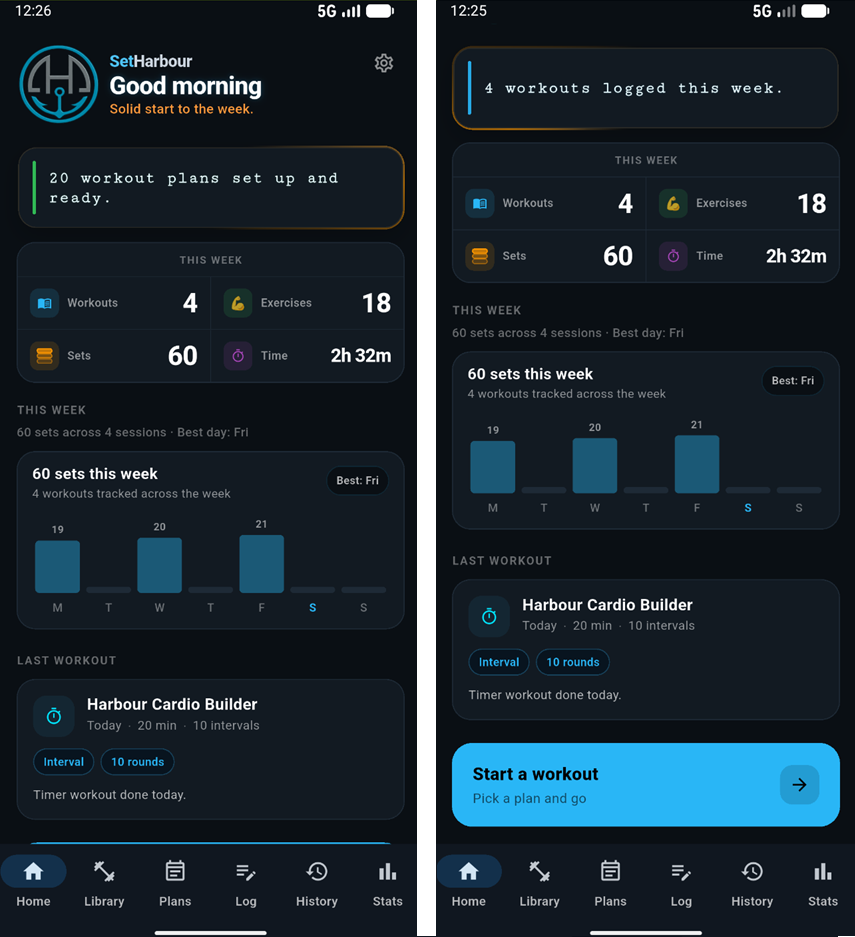
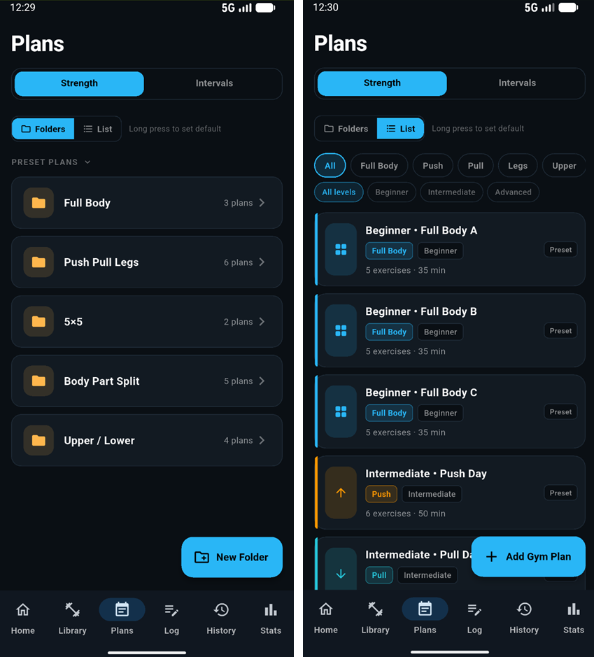
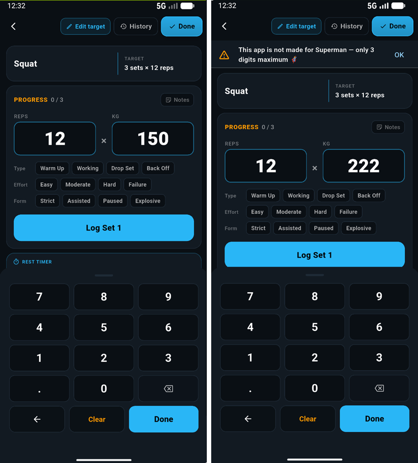
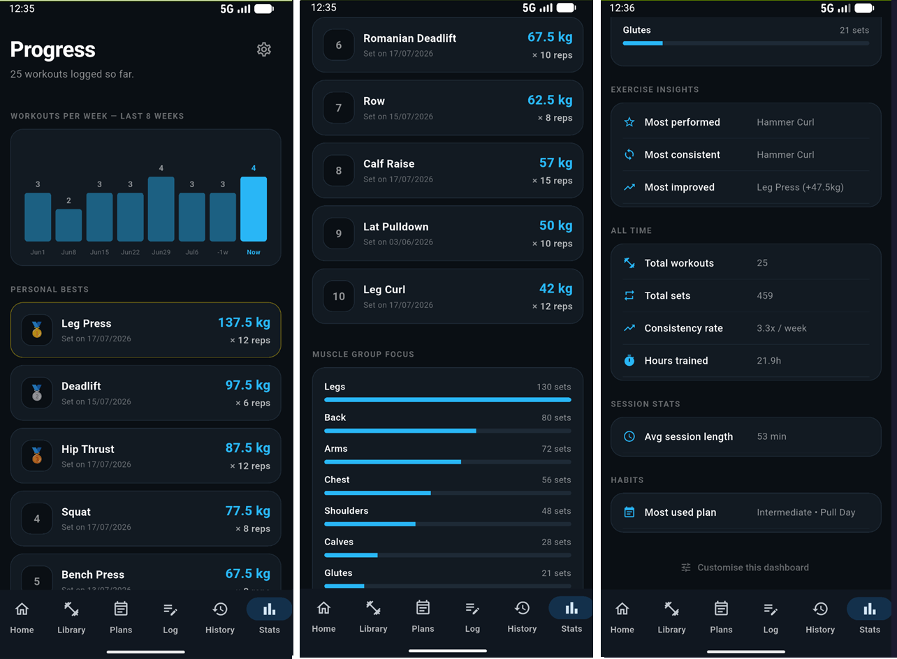
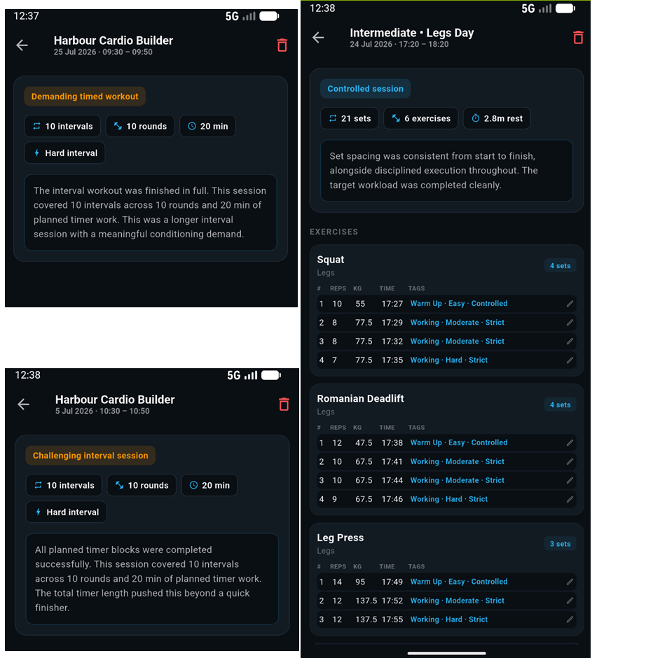
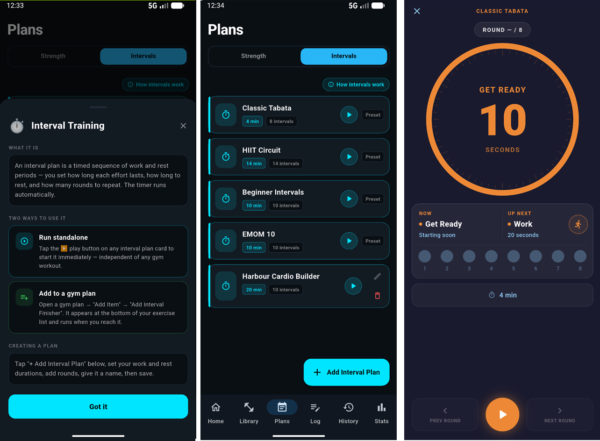
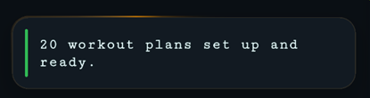
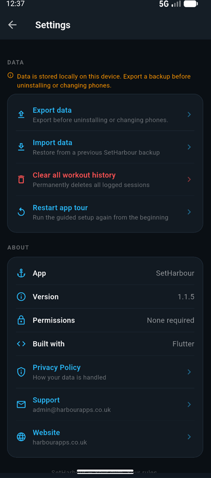
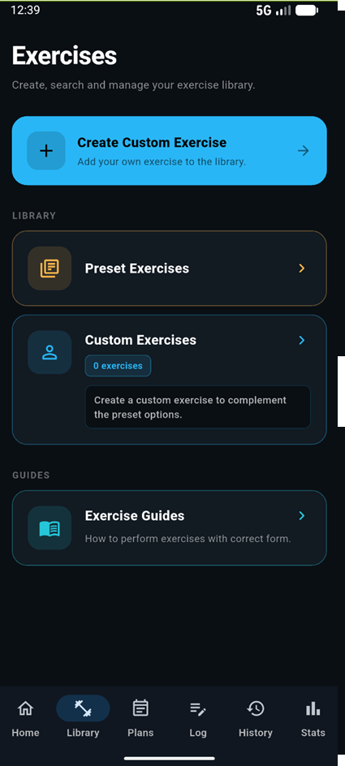

# SetHarbour — Code Showcase

**SetHarbour** is a privacy-first, fully offline workout tracker for Android,
built with Flutter. You can build workout plans, log strength sessions with a
custom keypad, run interval timers, and read plain-English summaries of your
training — all stored on your own device, with no account, no ads and no
analytics.

> **This repository contains selected, sanitised SetHarbour code for portfolio
> review. The complete production application, signing configuration, commercial
> files and private release assets are not included.**

This is a curated **code + design showcase**, not a runnable project. Each
feature below links to a focused folder under [`code/`](code/) containing the
strongest source files, a short write-up and the related screenshot. Longer
design essays live in [`docs/`](docs/).

---

## 📱 Screenshots

| Home dashboard | Plans (folder + list) | Exercise validation |
|---|---|---|
|  |  |  |

| Progress & statistics | Smart history insights | Interval workflow |
|---|---|---|
|  |  |  |

| LED status ticker | Backup & privacy | Exercise library |
|---|---|---|
|  |  |  |

See [`screenshots/README.md`](screenshots/README.md) for the full list.

## 🧩 Selected features

Each links to its code folder (source + a focused README):

| Feature | What it shows | Code |
|---|---|---|
| **Animated LED ticker** | A reusable status panel with a rotating gold border glow and LED-style scrolling text, with correct controller/timer disposal and a reduced-motion fallback. | [`code/animated-ticker/`](code/animated-ticker/) |
| **Exercise input validation** | A pure three-digit numeric rule kept separate from its branded message, with no crashes and no silent truncation. | [`code/exercise-validation/`](code/exercise-validation/) |
| **Plan browser (folder + list)** | One plan collection presented two ways — grouped folders or a filtered list — with a persisted default view. | [`code/plan-browser/`](code/plan-browser/) |
| **Interval timer engine** | A deterministic, unit-testable state machine (get-ready → work → rest → rounds → done) with safe timer handling. | [`code/interval-engine/`](code/interval-engine/) |
| **Insight engine** | Deterministic, on-device summaries of each workout — no external AI, no network, no invented conclusions. | [`code/insight-engine/`](code/insight-engine/) |
| **Progress calculations** | Weekly frequency, personal bests, muscle-group focus and exercise highlights, all derived from session data. | [`code/progress-calculations/`](code/progress-calculations/) |
| **Backup / import / export** | Local JSON serialisation with schema + version validation and idempotent merging. | [`code/backup-import-export/`](code/backup-import-export/) |

Focused tests for this logic are in [`test-examples/`](test-examples/).

### The "Superman" validation message

The three-digit input limit is enforced with a deliberately friendly line that
is an intentional part of SetHarbour's product personality (not a placeholder),
preserved verbatim across the app, screenshots and tests:

> **This app is not made for Superman — only 3 digits maximum 🦸**

It lives as a single constant, separate from the rule that triggers it — see
[`code/exercise-validation/`](code/exercise-validation/) and
[`docs/validation-and-error-handling.md`](docs/validation-and-error-handling.md).

## 🔒 Privacy-first design

SetHarbour is built so your workout data never leaves your device unless you
explicitly export it:

- Workout data is stored **locally** on the device.
- **No account** or sign-in is required.
- **No adverts**, **no analytics**, **no tracking SDKs**.
- **No developer-side collection** and **no external processing** of workout data.
- The production app ships **without the Android internet permission**.
- You control **JSON export and import** yourself.

Full detail in [`docs/privacy-design.md`](docs/privacy-design.md).

## 🧰 Technology used

- **Flutter** (Material 3) / **Dart**, null-safe
- `fl_chart` — dashboard & progress charts
- `shared_preferences` — a single on-device UI preference
- `path_provider` + `share_plus` + `file_picker` — local JSON export/import
- `intl` — date/number formatting

No analytics, advertising, crash-reporting or networking packages are used. The
design principle throughout is **pure, UI-independent logic** (validation,
insights, progress, timing, backup) that is directly unit-testable.

## 📚 Design docs

- [Architecture](docs/architecture.md)
- [Privacy design](docs/privacy-design.md)
- [UI/UX decisions](docs/ui-ux-decisions.md)
- [Validation & error handling](docs/validation-and-error-handling.md)
- [Insight engine](docs/insight-engine.md)
- [Testing strategy](docs/testing-strategy.md)
- [Technical challenges](docs/technical-challenges.md)

## ▶️ Google Play

[Download SetHarbour from Google Play](https://play.google.com/store/apps/details?id=com.harbourapps.setharbour)

## 🔗 HarbourApps

Website & support: <https://harbourapps.co.uk/app-support/>

## 👤 Author & licence

Designed and built by **Shaid Sharif** (HarbourApps). The sanitised code in this
repository is released under the [MIT Licence](LICENSE), which covers **only**
this showcase code — not the full production SetHarbour application, its release
configuration, or any private commercial assets, none of which are included here.

> **Note:** The files under `code/` are selected, sanitised excerpts provided for portfolio review. Their local imports have been organised so every referenced showcase file resolves within this repository, but the repository intentionally excludes the complete runnable application and platform configuration.
